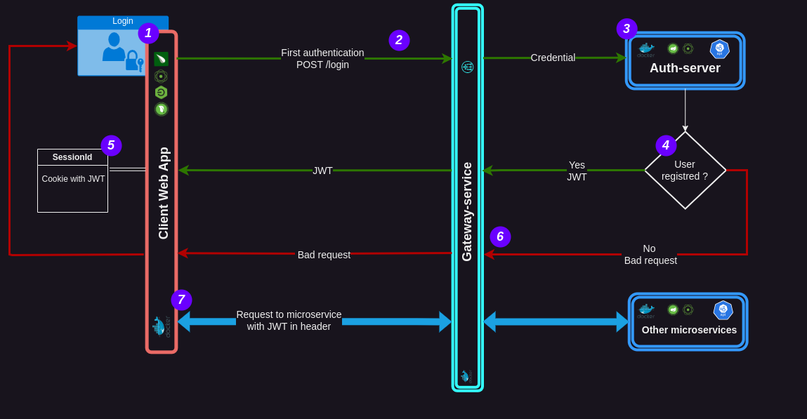

# <div align="center">Medilabo Solutions</div>

**<p align="center">A Spring-boot demo application to help doctors to identify patients most at risk of type 2 diabetes.</p>**

  <div align="center"> 
  <br>

      </br>    </div>

<details><summary><strong>Table of content</strong></summary>

- [Medilabo Solutions](#medilabo-solutions)
  - [Architecture](#architecture)
  - [Security](#security)
  - [Tests](#tests)
  - [Run application](#run-application)
    - [With docker](#with-docker)
    - [Locally](#locally)
    - [Credential](#credential)
  - [Tech Stacks](#tech-stacks)
  - [Improvements](#improvements)
  - [Versions](#versions)

</details>  

---

## Architecture


As we can see in architectural diagram above,this Spring-boot application is a multi modules project. Each module is a micro-service and has one task with one dedicated port:

- **On BackEnd:**

Name  | Port| Definition
------|------|---------
 **Gateway-service** | 8081| route requests from web-app to Rest API micro-services
 **Eureka-server**   | 8082| manage a registry of all micro-service's instances using load balancing
 **Config-server**   | 9101| server to deliver external configuration properties for each microservices
 **Auth-server**     |8084| Rest API to check authentication and authorization of user connected to web-app
 **Patient-service** |8083 | Rest API connected to MySql dbto manage registred patients in the application
 **Note-service** |8085|Rest API connected to MongoDb db to manage registred notes of patients provided by doctors
 **Risk-service** |8086|Rest API to provide disease risk assessment for a patient base on his notes

- **On Front-end:**

Finally, we have a web application , it could be a mobile application or Single Page Application, but for this project, we use a web application with Spring-boot and Thymeleaf to do the job. Of course, it's place is between the gateway and the user's browser and provides a IHM with html pages.

Name         | Port | Definition
-------------|------|----------
 **web-app** | 8080 | provide a GUI for browser, requests to Gateway and create html pages with results ...

---

## Security

We use Spring security to securize application.

For this moment, as application is not a release version, we have just implemented one registred user in memory (see chapter of [credential](#credential)) to log in it.

The secure access to application follows the following principles:



1. First in the web-app, a classic ***username-password authentication*** is needed through form in login page
2. Next this credential is passed through Gateway-service to Auth-server by the way of ***Http-basic authentication***.
3. The ***Auth-server microservice*** is responsible of authentication and authorization of registred users. As seen above,actually there is only one user registred for the demonstration.
4. Once authentication is completed, then Auth-server return to the web-app via the GateWay-service a ***unique JWT token*** that identifies the registred user if it exists or a response with  bad request status if not.
5. if the user is recognized then received JWT token is store in a ***cookie session of web-app*** to be used for every next requests to microservices.
6. if the user isn't recognized then spring security of web-app ***redirect user to the login page*** with a message of error "wrong username or password".
7. For each new requests, they all go through gateway-service that ***checks the existence and validation of the JWT token*** stored in bearer authentication header provided by web-app from its session cookie

---

## Tests

Microservices below was tested with unit tests for services and with integration tests for their controller (by clicking on them, you can see their jacoco report):

<details><summary><strong>Patient-service</strong></summary>

  
</details>
<details><summary><strong>note-service</strong></summary>

  
</details>

<details><summary><strong>risk-service</strong></summary>

  
</details>

## Run application

### With docker

We suppose that you have already install and configure Docker  and it's compose plugin on your computer. If it's not the case, you can follow these documentations:

- [Install Docker](https://docs.docker.com/get-docker/)
- [Install Docker Compose](https://docs.docker.com/compose/install/)

After a completed installation, as all microservices have their own ***DockerFile*** and there is a ***docker-compose.yaml*** at the root of project. You can run the project just by using the following command without worrying about the compilation order and dependencies:

```bash
docker compose up -d
```

### Locally

1. You have to create manually patient-service database in your Mysql db
2. You have to
3. Use the maven command `mvn spring-boot:run` to start all microservices in this application. But don't forget to respect the following order

    Order | name of service
    ------|----------------
    1|Config-server
    2|Eureka-server
    3|Gateway-service
    4|Auth-server
    5|Patient-service
    6|Note-service
    7|Risk-service
    8|web-app

### Credential

We use Spring Security to secure application. As the application is not yet a release but a testing version, a predefined user was registred in Memory. So, you must use his basic credential, defined below, to login to application:

```bash
username:   user
password:   password
```

---

## Tech Stacks

Technical Stack|version
---------------|:------:
Java Openjdk| **17**
Maven |**3.1.2**
Spring-Boot| **3.1.7**
Spring-webflux|**6.0.15**
Spring-security |**6.1.6**
Spring-cloud-config |**4.0.4**
Spring-cloud-gateway |**4.0.7**
Spring-cloud-netflix-eureaka |**4.0.3**
Spring-boot actuator |**3.1.17**
Mongodb|**6.0.13**
Mongodb reactive |**3.1.7**
Mysql | **8.2.0**
R2dbc-Mysql |**1.0.2**
Thymeleaf |**3.1.7**
Jupiter |**5.9.3**
Jacoco |**0.8.10**
Lombok |**1.18.30**

---

## Improvements

---

## Versions
