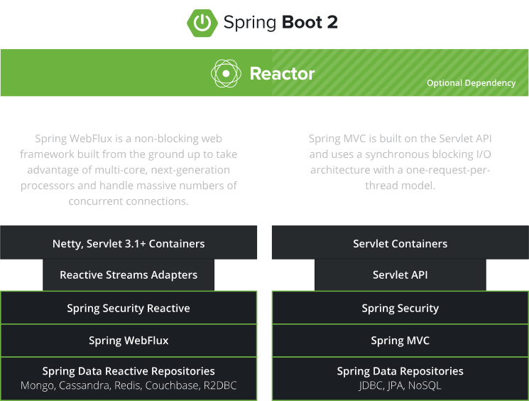
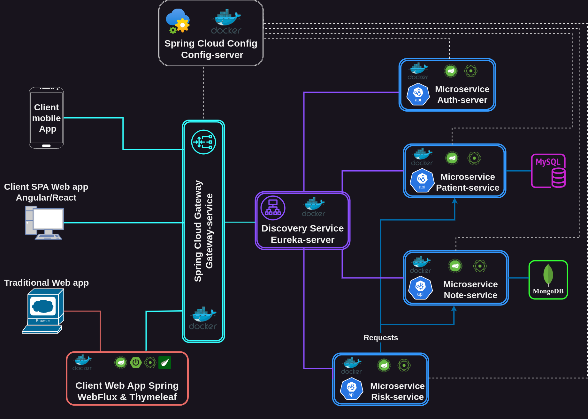

<div align="center">

# Medilabo Solutions

</div>

<div align="center">


</div>

**<p align="center">A Spring-boot demo application to help doctors to identify patients most at risk of type 2 diabetes.</p>**

  <div align="center">
  <br>

      </br>    </div>

---

<details>
<summary><strong>Table of content</strong></summary>

- [Medilabo Solutions](#medilabo-solutions)
  - [Introduction](#introduction)
  - [Architecture](#architecture)
  - [Security](#security)
  - [Tests](#tests)
  - [Run application](#run-application)
    - [With docker](#with-docker)
  - [Tech Stacks](#tech-stacks)
  - [Versions](#versions)

</details>  

---

## Introduction

<div align="center">


</div>

This project was build with **[Reactive Processing](https://spring.io/reactive/)** a paradigm that enables build non-blocking and asynchronous code.

As we need to use **[Spring Cloud Gateway](https://docs.spring.io/spring-cloud-gateway/reference/spring-cloud-gateway.html)** an API Gateway built on top of the Spring Ecosystem, including: **Spring 6, Spring Boot 3 and Project Reactor** that provide a effective non-blocking way to route to APIs, it was naturally logic to build also REST APIs in this reactive way with **[Spring webFlux](https://docs.spring.io/spring-framework/reference/web/webflux.html)** and not Spring MVC.

<div align="center">


</div>

This thoughtful choice was very interesting due to the discovery of new technical stacks and the use of Project Reactor classes like `Mono` and `Flux`.

It should be noted, however, that we use too Spring Webflux for the Web-App with Thymeleaf to easely bind data to web pages. It is a choice linked to my current knowledge and a futur improvement would be to replace web-app with a true reactive Single Page Application implemented with Angular or React... 😃

## Architecture



As we can see in architectural diagram above,this Spring-boot application is a multi modules project. Each module is a micro-service and has one task with one dedicated port:

- **On BackEnd:**

Name                | Port | Definition
--------------------|------|-------------------------------------------------------------------------------------------
**Gateway-service** | 8081 | route requests from web-app to Rest API micro-services
**Eureka-server**   | 8082 | manage a registry of all micro-service's instances using load balancing
**Config-server**   | 9101 | server to deliver external configuration properties for each microservices
**Auth-server**     | 8084 | Rest API to check authentication and authorization of user connected to web-app
**Patient-service** | 8083 | Rest API connected to MySql dbto manage registred patients in the application
**Note-service**    | 8085 | Rest API connected to MongoDb db to manage registred notes of patients provided by doctors
**Risk-service**    | 8086 | Rest API to provide disease risk assessment for a patient base on his notes

- **On Front-end:**

Finally, we have a web application , it could be a mobile application or Single Page Application, but for this project, we use a web application with Spring-boot and Thymeleaf to do the job. Of course, it's place is between the gateway and the user's browser and provides a IHM with html pages.

Name        | Port | Definition
------------|------|--------------------------------------------------------------------------------------
**web-app** | 8080 | provide a GUI for browser, requests to Gateway and create html pages with results ...

[Page up :arrow_heading_up:](#medilabo-solutions)

## Security

We use **Spring security reactive**  to securize this application.

For this moment, as application is not a release version, we have just implemented one registred user in memory (see chapter of [credential](#credential)) to log in it.

The secure access to application follows the following principles:


1. First in the web-app, a classic ***username-password authentication*** is needed through form in login page
2. Next this credential is passed through Gateway-service to Auth-server by the way of ***Http-basic authentication***.
3. The ***Auth-server microservice*** is responsible of authentication and authorization of registred users. As seen above,actually there is only one user registred for the demonstration.
4. Once authentication is completed, then Auth-server return to the web-app via the GateWay-service a ***unique JWT token*** that identifies the registred user if it exists or a response with  bad request status if not.
5. if the user is recognized then received JWT token is store in a ***cookie session of web-app*** to be used for every next requests to microservices.
6. if the user isn't recognized then spring security of web-app ***redirect user to the login page*** with a message of error "wrong username or password".
7. For each new requests, they all go through gateway-service that ***checks the existence and validation of the JWT token*** stored in bearer authentication header provided by web-app from its session cookie

[Page up :arrow_heading_up:](#medilabo-solutions)

## Tests

Microservices below was tested with Jupiter  with unit tests for services and with integration tests for their controller (by clicking on them, you can see their jacoco report):

<details><summary><strong>patient-service</strong></summary>

  
</details>
<details><summary><strong>note-service</strong></summary>

  
</details>

<details><summary><strong>risk-service</strong></summary>

  
</details>

And All endpoints was tested with postman  to ensure response of each API.

[Page up :arrow_heading_up:](#medilabo-solutions)

## Run application

### With docker

We suppose that you have already install and configure **Docker**  and its **compose plugin** as well as **Maven** on your computer. If it's not the case, you can follow these documentations:

- **[Install Docker](https://docs.docker.com/get-docker/)**
- **[Install Docker Compose](https://docs.docker.com/compose/install/)**
- **[Install Maven](https://maven.apache.org/install.html)**

Each microservice has its own ***DockerFile*** and there is a ***docker-compose.yaml*** at the root of project.

To run application, follow theses instructions:

1. ***Clone the project*** from github repository via https ***[MedilaboSolutions](https://github.com/delaval-htps/MediLabo-Solutions_P9_OC.git)***:
  
    ```bash
    git clone https://github.com/delaval-htps/MediLabo-Solutions_P9_OC.git
   ```

2. ***Go to the root of project*** directory:

    ```bash
    cd MediLabo-Solutions_P9_OC
    ```

3. ***Launch mvn build command*** below:

    ```bash
    mvn clean package spring-boot:repackage
    ```

4. Now,you can **run the project** just by using the following command without worrying about the compilation order and dependencies:

    ```bash
    docker compose up -d
    ```

5. Open a browser and got to **`localhost:8080`**, the application is running 😄

NB: As the project is in demonstration stage and to enable you to launch it without problems to test it, we decided to push on repository the `.env file`.

Of course, for futur production release, this file will be remove from repository and will be accessible only for developpers :wink:

[Page up :arrow_heading_up:](#medilabo-solutions)

### Locally with maven

1. **For Mysql db** , as we use ***[Spring-Webflux](https://docs.spring.io/spring-framework/reference/web/webflux.html)*** and the ***Reactive Relational Database Connectivity*** to access to Mysql databases ***[R2dbc](https://r2dbc.io)***, we have to:
<br/>

   - ***Create manually a database named*** `patient-service` ***in your MySql db*** before bootstrap microservice patient-service. Indeed, R2dbc not supports ORM like Hibernate so we can't create automatically database at start-up like in traditional Spring MVC application.
<br/>

   - ***Create a MySql user*** `admin_patient_service` with all grant privileges on this database patient_service to ensure access to it. You can find his credential in this repository's directory ***[Medilabo-Solutions-Config-Server/patient-service.properties](https://github.com/delaval-htps/MediLabo-Solutions-Config-Server/blob/master/patient-service.properties)***.
<br/>

2. **For MongoDB**, we have just to create a MonoDb user `admin_mogodb`. You can find his credential and configuration in this repository's directory ***[Medilabo-Solutions-Config-Server/note-service-dev.properties](https://github.com/delaval-htps/MediLabo-Solutions-Config-Server/blob/master/note-service-dev.properties)***.
<br/>

3. **Finally, use the maven**command `mvn spring-boot:run` to start all microservices in this application. But don't forget to respect the following order:

Order | name of service
:----:|----------------
  1   | Config-server
  2   | Eureka-server
  3   | Gateway-service
  4   | Auth-server
  5   | Patient-service
  6   | Note-service
  7   | Risk-service
  8   | web-app

[Page up :arrow_heading_up:](#medilabo-solutions)

### Credential

We use Spring Securityto secure application.

As the application is not yet a release but a testing version, a predefined user was registred in Memory. So, you must use his basic credential, defined below, to login to application:

```bash
username:   user
password:   password
```

[Page up :arrow_heading_up:](#medilabo-solutions)

## Tech Stacks

Technical Stack              |   version
-----------------------------|:----------:
Java Openjdk                 |   **17**
Maven                        |  **3.1.2**
Spring-Boot                  |  **3.1.7**
Spring-webflux               | **6.0.15**
Spring-security              |  **6.1.6**
Spring-cloud-config          |  **4.0.4**
Spring-cloud-gateway         |  **4.0.7**
Spring-cloud-netflix-eureaka |  **4.0.3**
Spring-boot actuator         | **3.1.17**
Mongodb                      | **6.0.13**
Mongodb reactive             |  **3.1.7**
Mysql                        |  **8.2.0**
R2dbc-Mysql                  |  **1.0.2**
Thymeleaf                    |  **3.1.7**
Jupiter                      |  **5.9.3**
Jacoco                       | **0.8.10**
Lombok                       | **1.18.30**

[Page up :arrow_heading_up:](#medilabo-solutions)

## Versions

- **V0.0.2**
  
  Just a HotFix to change links to Config-server in github
  
- **V0.0.1-SNAPSHOT**
  
  As we said earlier this project is a first demonstration application to a future release project and it has to be validate by developper's team. So this is the reason why I don't change version and it is still on `V0.0.1-SNAPSHOT`

[Page up :arrow_heading_up:](#medilabo-solutions)
